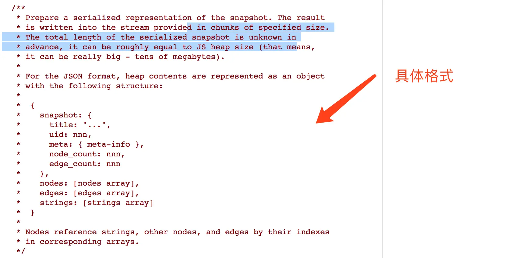

# NodeUI 内存 heapdump 分析

## 安装

```shell
pnpm install
```

> [知识库文档](https://ku.baidu-int.com/d/KLfeTfgWdfcCzL)

## Quick Start

创建 `.env` 环境变量：

```
# snapshot url地址
SNAPSHOT_URL=http://10.138.36.243:8000/cloud-disk/heapsnapshots/
# 下载文件目录
PATH=./download/
# 目标卡片
TARGET=
# 是否开启LOG
LOG=1
```

## Snapshot

内存快照是按照 Graph 图的格式展现的，可以用来分析内存占用情况。
主要包含：**nodes/edges/strings** 三个部分。

### JSON 文件格式

V8 内存快照 JSON 格式如图：


每个节点的信息：

```js
/**
 * 获取图中的节点信息
 *
 * @param {object} graph 图对象
 * @param {number} i 节点索引
 * @returns {object} 节点信息对象，包含type、name、id、size和edgeCount属性
 */
export function getGraphNode(graph, i) {
    return {
        type: graph.nodes[i],
        name: graph.strings[graph.nodes[i + 1]],
        id: graph.nodes[i + 2],
        size: graph.nodes[i + 3],
        edgeCount: graph.nodes[i + 4]
    };
}
```

### nodes 属性

| 下标 | 属性          | 类型   |
| :--- | :------------ | :----- |
| n    | type          | number |
| n+1  | name          | string |
| n+2  | id            | number |
| n+3  | self_size     | number |
| n+4  | edge_count    | number |
| n+5  | trace_node_id | number |

### edges 属性

| 下标 | 属性       | 类型          |
| :--- | :--------- | :------------ |
| n    | type       | number        |
| n+1  | name_index | string_number |
| n+2  | to_node    | node          |

type 的类型：

| 值 | 含义     |
| :- | :------- |
| 0  | context  |
| 1  | element  |
| 2  | property |
| 3  | internal |
| 4  | hidden   |
| 5  | shortcut |
| 6  | weak     |

### nodes edges 对应关系

```js
let edgeOffset = 0;
for (let i = 0; i < nodes.length; ++i) {
    const node = nodes[i];
    const edgeCount = node.edge_count;
    if (edgeCount) {
        for (let j = 0; j < edgeCount; ++j) {
            const edgeType = edges[edgeOffset];
            const edgeNameIndex = edges[edgeOffset + 1];
            const edgeToNode = edges[edgeOffset + 2];
            edgeOffset += 3;
        }
    }
}
```

## 参考文章

1. [js heapdump解析 - 掘金](https://juejin.cn/post/6844903545737576456)
2. [V8 源码](https://source.chromium.org/chromium/chromium/src/+/main:v8/include/v8-profiler.h)
3. [OneHeap](https://github.com/longtian/javascript_performance_measurement/tree/gh-pages/heap_snapshot)
